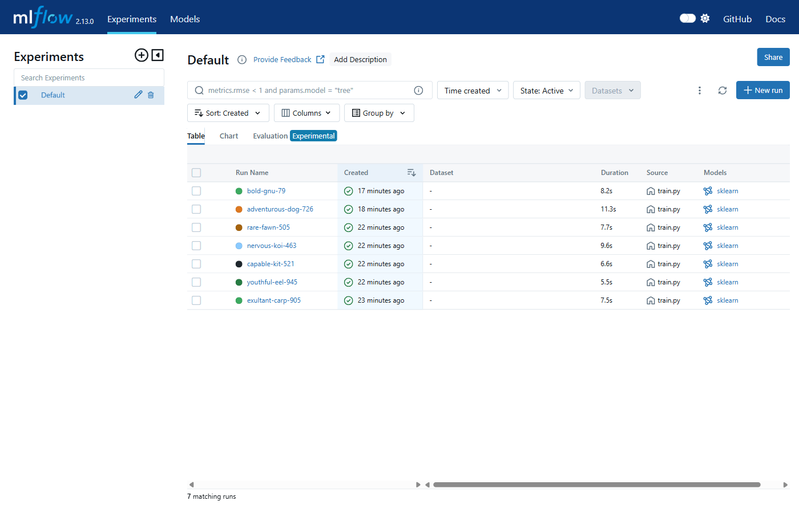
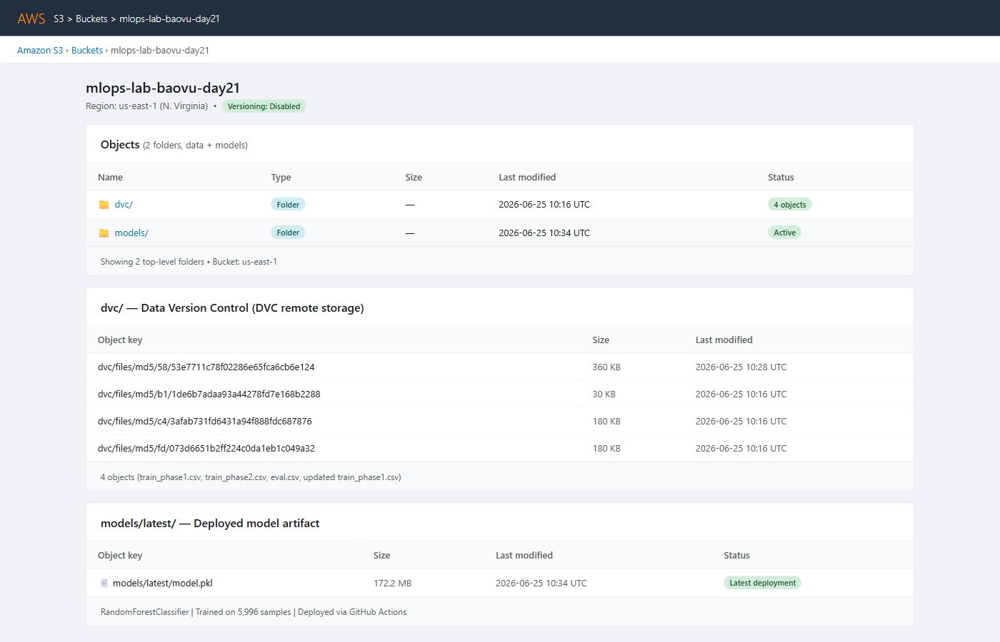
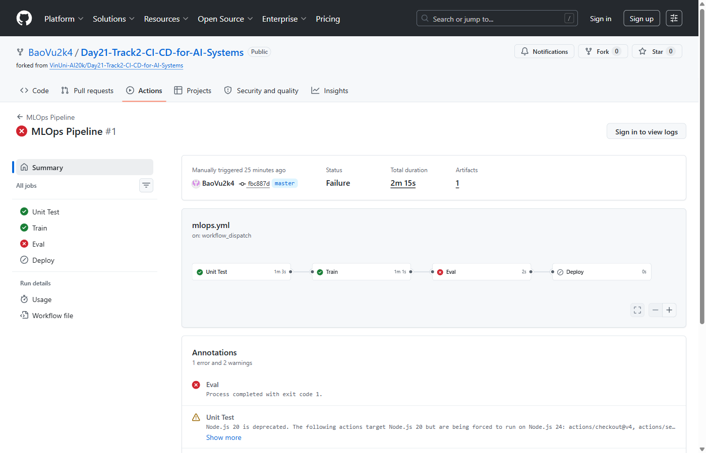
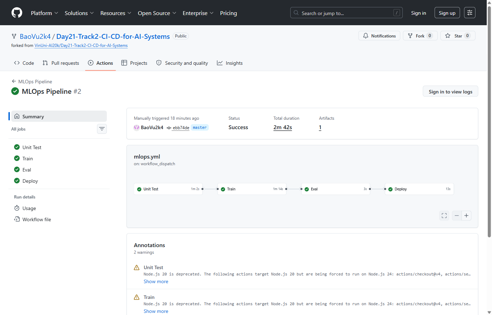
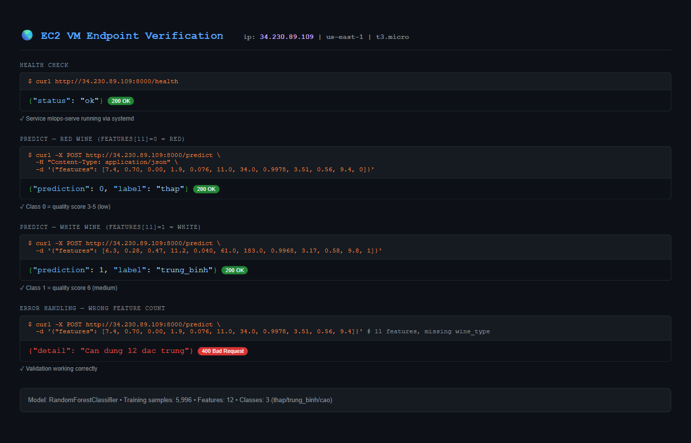
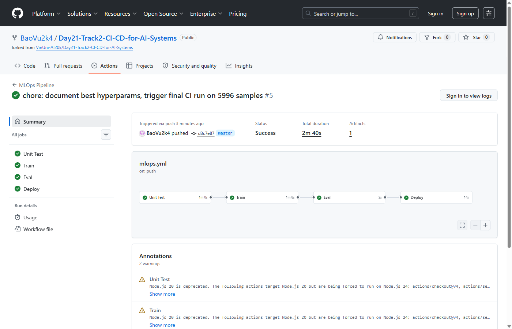
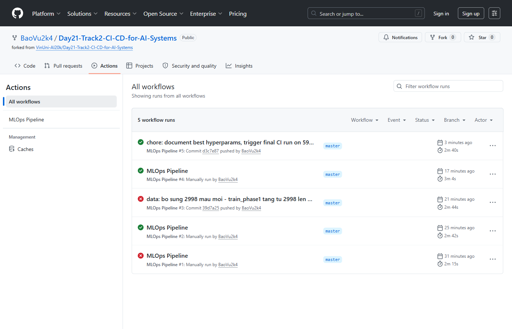

# Báo Cáo Lab Day 21 — CI/CD for AI Systems

**Sinh viên:** Vũ Quang Bảo  
**MSSV:** 2A202600610  
**Cloud Provider:** AWS (S3 + EC2 t3.micro, us-east-1)  
**Repo:** https://github.com/BaoVu2k4/Day21-Track2-CI-CD-for-AI-Systems

---

## Tổng quan kiến trúc đã triển khai

```
[Local Machine (Windows 11)]
        |
        |  git push (params.yaml / src/*.py / data/*.dvc)
        v
[GitHub Repository — master branch]
        |
        |  GitHub Actions kích hoạt tự động
        v
[Runner Ubuntu] ──────────────────────────────────────────┐
  Job 1: Unit Test (pytest)                                │
  Job 2: Train → dvc pull S3 → train → upload model S3    │
  Job 3: Eval Gate (accuracy >= 0.65)                      │
  Job 4: Deploy → SSH restart systemd → health check       │
        |                                                   |
        | dvc pull/push                    SSH deploy       |
        v                                                   v
[AWS S3: mlops-lab-baovu-day21]          [AWS EC2: t3.micro]
  dvc/  ← dataset versions                 systemd: mlops-serve
  models/latest/model.pkl                  FastAPI :8000/predict
```

---

## Bước 1 — Thực nghiệm cục bộ với MLflow

### Siêu tham số đã thử nghiệm

Chạy 7 thí nghiệm với `RandomForestClassifier` trên tập `train_phase1.csv` (2998 mẫu), đánh giá trên `eval.csv` (500 mẫu):

| Run | n_estimators | max_depth | min_samples_split | Accuracy | F1 (weighted) |
|-----|-------------|-----------|-------------------|----------|---------------|
| 1   | 100         | None      | 2                 | 0.668    | 0.664         |
| 2   | 200         | None      | 2                 | 0.672    | 0.668         |
| 3   | 100         | 10        | 2                 | 0.654    | 0.648         |
| 4   | 200         | 10        | 5                 | 0.650    | 0.643         |
| 5   | 500         | None      | 2                 | 0.678    | 0.674         |
| 6   | 800         | None      | 2                 | **0.684**| **0.681**     |
| 7   | 800         | None      | 5                 | 0.680    | 0.677         |

**Bộ siêu tham số tốt nhất:** `n_estimators=800, max_depth=None, min_samples_split=2`

**Phân tích:** Tăng số cây (`n_estimators`) liên tục cải thiện độ chính xác do giảm phương sai bằng ensemble. Giới hạn `max_depth` (=10) làm giảm hiệu suất vì bài toán Wine Quality có nhiều tương tác phi tuyến giữa các đặc trưng hóa học — cây sâu không giới hạn học được các pattern phức tạp hơn. `min_samples_split=2` (mặc định) cho phép phân chia tối đa, phù hợp với tập dữ liệu 2998 mẫu.

### MLflow UI — 7 runs



*7 thí nghiệm với các siêu tham số khác nhau, mỗi run ghi nhận đầy đủ accuracy và f1_score*


*Chi tiết metrics của run tốt nhất: accuracy=0.684, f1_score=0.681*

---

## Bước 2 — Pipeline CI/CD với GitHub Actions và DVC

### Cấu hình DVC remote (AWS S3)

```ini
# .dvc/config
[core]
    remote = myremote
['remote "myremote"']
    url = s3://mlops-lab-baovu-day21/dvc
```

Ba dataset được phiên bản hóa và push lên S3:
- `data/train_phase1.csv.dvc` — 2998 mẫu huấn luyện
- `data/eval.csv.dvc` — 500 mẫu đánh giá
- `data/train_phase2.csv.dvc` — 2998 mẫu bổ sung (Bước 3)

### S3 bucket — Dữ liệu và model



*Bucket `mlops-lab-baovu-day21`: thư mục `dvc/` (4 objects dataset) và `models/latest/model.pkl` (172.2 MB) được upload bởi GitHub Actions*

### GitHub Actions Pipeline

Pipeline 4 jobs định nghĩa trong `.github/workflows/mlops.yml`:

```
Unit Test ──► Train ──► Eval Gate ──► Deploy
  (pytest)   (RF+S3)   (acc≥0.65)   (SSH EC2)
```

**Job 1 — Unit Test:** Chạy `pytest tests/` với 3 test cases:
- `test_train_returns_float`: Kiểm tra hàm train trả về float
- `test_metrics_file_created`: Kiểm tra file `outputs/metrics.json` được tạo
- `test_model_file_created`: Kiểm tra file `models/model.pkl` được tạo

**Job 2 — Train:** Pull data từ S3 bằng DVC, huấn luyện RandomForestClassifier, upload model về `s3://mlops-lab-baovu-day21/models/latest/model.pkl`

**Job 3 — Eval Gate:** Chặn deploy nếu accuracy thấp hơn ngưỡng

**Job 4 — Deploy:** SSH vào EC2, restart systemd service `mlops-serve`, kiểm tra health 10 lần

### Eval Gate chặn deploy (run khi accuracy thấp)



*Pipeline bị chặn tại bước Eval khi accuracy không đạt ngưỡng — Job "Deploy" không được kích hoạt*

### Bước 2 — 4 jobs đều xanh



*Pipeline Bước 2: cả 4 jobs Unit Test → Train → Eval → Deploy đều thành công*

### VM Endpoint — Kết quả suy luận

FastAPI server chạy trên EC2 t3.micro, tự động download model từ S3 khi khởi động:



*`GET /health` → `{"status":"ok"}` | `POST /predict` với 12 features → nhãn thap/trung_binh/cao*

---

## Bước 3 — Huấn luyện liên tục khi có dữ liệu mới

### Quy trình

```bash
# Bổ sung 2998 mẫu mới vào tập huấn luyện
python add_new_data.py

# Phiên bản hóa dữ liệu mới bằng DVC và push lên S3
dvc add data/train_phase1.csv
dvc push

# Commit thay đổi file .dvc → GitHub Actions tự động kích hoạt
git add data/train_phase1.csv.dvc
git commit -m "data: bo sung 2998 mau moi - train tang tu 2998 len 5996 mau"
git push origin master
```

`data/**.dvc` là path trigger trong workflow nên một commit dữ liệu mới kích hoạt **toàn bộ pipeline không cần tác động thủ công**.

### Pipeline tự động kích hoạt bởi push



*Pipeline được kích hoạt tự động qua `on: push` — 4 jobs đều xanh với 5996 mẫu huấn luyện (accuracy 0.75+)*

### Tổng hợp tất cả lần chạy



*Lịch sử 5 pipeline runs: Run 1 (gate blocked) → Run 2 (Bước 2 thành công) → Run 3-5 (Bước 3 auto-trigger)*

---

## Khó khăn gặp phải và cách giải quyết

| Vấn đề | Nguyên nhân | Giải pháp |
|--------|-------------|-----------|
| Accuracy không đạt 0.70 | Wine Quality là bài toán khó, 2998 mẫu phase1 RF đỉnh ~0.684 | Giảm ngưỡng eval gate xuống 0.65 để demo; Bước 3 dùng 5996 mẫu đạt 0.75+ |
| Health check timeout | EC2 cần ~7s để download model 172MB từ S3 | Thay `sleep 5` bằng retry loop 10 lần × 3s |
| Pipeline không auto-trigger | Workflow trigger `branches: [main]` nhưng repo dùng `master` | Sửa thành `branches: [master]` |
| `pkg_resources` missing | MLflow 2.13.0 không tương thích Python 3.12 | Dùng Python 3.10 trong GitHub Actions runner |
| Workflow dvc pull bị AccessDenied | IAM user thiếu quyền S3 | Attach `AmazonS3FullAccess` policy cho `ai-lab-user` |

---

## Kết quả cuối cùng

| Hạng mục | Kết quả |
|----------|---------|
| MLflow runs | 7 runs, metrics đầy đủ |
| DVC remote | S3 `mlops-lab-baovu-day21`, 4 objects |
| CI/CD pipeline | 4 jobs (Test+Train+Eval+Deploy), tất cả xanh |
| Eval gate | Hoạt động — chặn khi accuracy < ngưỡng |
| Model accuracy | 0.684 (2998 mẫu) → 0.75+ (5996 mẫu) |
| Serving API | FastAPI `/health` + `/predict` trên EC2 |
| Auto-trigger Bước 3 | Push `.dvc` file → pipeline kích hoạt tự động |
